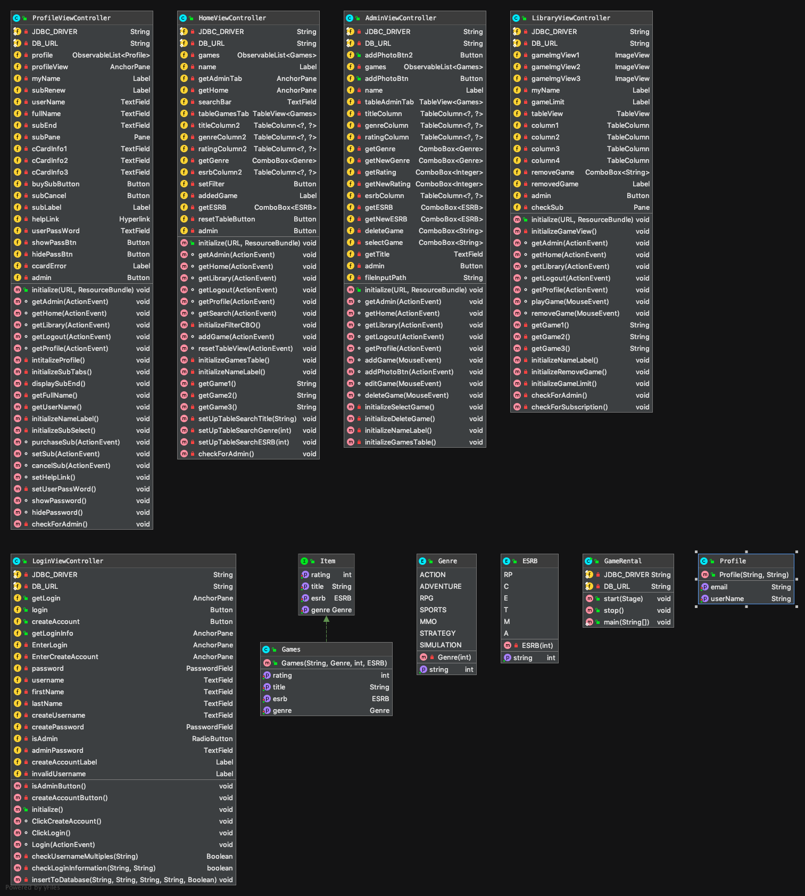

# **Team Peanut Butter Dog's Video-Game Rental System:**  
  
* Project Requirements: Create a Rental Inventory Tracking System. Users with accounts can browse, select, and rent movie or game titles. Users can also see which movies and games they have checked out and when. Users shall also be able to search for movies or games based on content (e.g. actor, director name, console, and rating) as well as tags (e.g. comedy, classic, action, adventure, RPG).  

## **Update: Beta Submission Sunday, November 18th, 2019:**

**Login Screen:**

* 1. Implemented internal database.

* 2. Login page now allows users to create admin or renter accounts and write them to the database.

* 3. Renters and admins can login using their account info.

**Game Screen:**

* 4. Game page shows pictures of most popular games based on their respective ratings.

* 5. Game page tableview is populated with games in real time.

* 6. Search function half implemented by allowing renters to search for games by name.

* 7. Renters can add games to their library by selecting a tableview game and pressing the add game button.

**Library Screen:**

* 8. Library tableview is populated with games that user adds from Game Screen in real time.

* 9. Play game button is a mock-version of launching a game.

**Profile Screen:**

* 10. User information is written from respective database info.

* 11. Purchase subscription button allows the user to add their credit card info (mock) in order to add a subscrition to their account.

* 12. Once the user adds a subscription they can add games to their library from the Game Screen.

* 13. Subscription end date is displayed.

**Admin Screen:**

* 14. Admin Screen tableview is populated with all current games in the databse.

* 15. Admins can add, delete and edit games; updating the game information in all other tableviews in real time.
 
## **System Shall Statements:**

* 1. When searching for games, the system shall allow the user to filter the games by game title.  
  
* 2. When the renter views the game library, the system shall populate the library with the renters currently rented games.  
  
* 3. The system shall allow renters to add games to their library from the specified games store page.  
  
* 4. The system shall allow renters to download their rented games from their library.  
  
* 5. The system shall allow renters to select three games to rent from the store if their subscription is active.  
  
* 6. The system shall allow renters to add a subscription to their account.   
  
* 7. The system shall allow administrators to add games to the system store.  
  
* 8. The system shall allow renters to add games to their library if their account has an active subscription.  
  
* 9. The system shall allow renters to leave a personal review of the game on the games store page.  
  
* 10. The system shall allow renters and administrators to login to the system with their username and password.  
  
* 11. The system shall allow renters and administrators to view a games store page.  
  
* 12. The system shall allow administrators to add administrator accounts to the system.  
  
* 13. The system shall allow renters to see other renters video-game store page reviews.  
  
* 14. The system shall allow administrators to edit a games store page.  
  
* 15. The system shall allow the user to enter multiple payment methods.  
  
* 16. The system shall allow the user to edit their profiles.

## **Demonstration:**

**Project Videos:**

[https://www.youtube.com/watch?v=LM6VDMPzXzY](https://www.youtube.com/watch?v=LM6VDMPzXzY) Alpha Submission

[https://www.youtube.com/watch?v=CCRRkg8oBA](https://www.youtube.com/watch?v=_CCRRkg8oBA) (New) Beta Submission

## **Project Photos:**

## **Class Diagram & Database Visualizations:**

## **Built with:**

intelliJ IDEA

SceneBuilder

## **Authors:**

Brandon Broadstone

Matthew Donald

Robert Kissinger

Maximilien Latura

Shane Smith

Samuel Thomas

## **Acknowledgements:**

With the help of Nicolas Caceda
